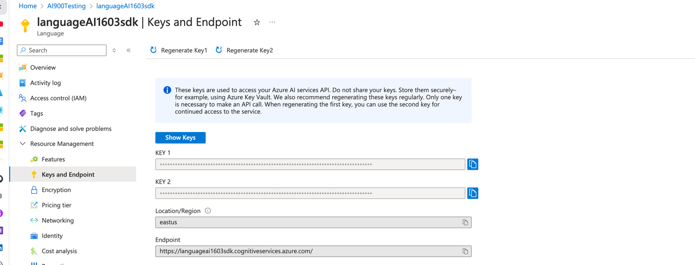

# **Sentiment Analysis/Recognize Entities/Detect language using python SDK** 

This project deals with the connection of endpoint to Langauge services in azure. Refer the documentation below.

https://pypi.org/project/azure-ai-textanalytics/5.2.0b4/

1) Create a language services on azure

2) Copy the endpoint and key in python code to test these NLP language services